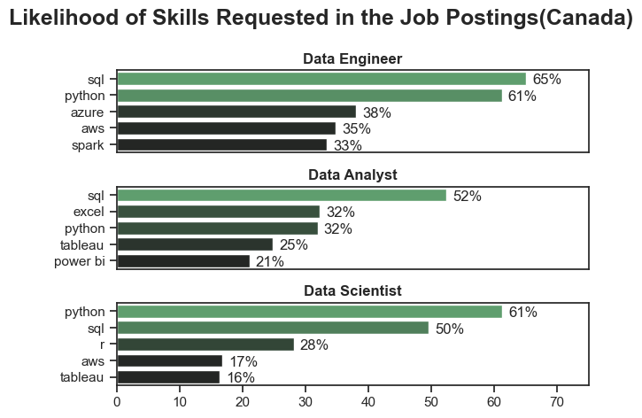
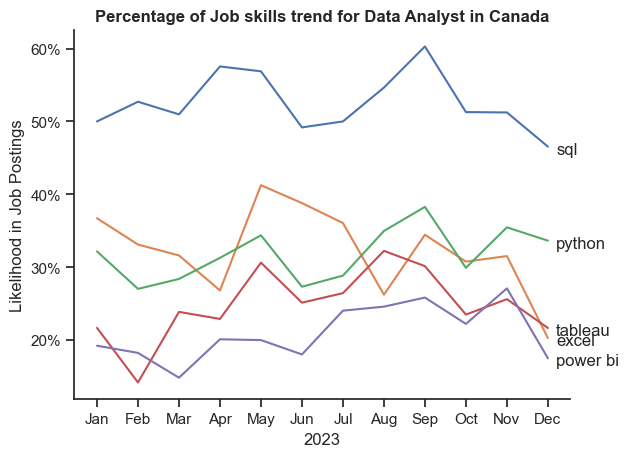
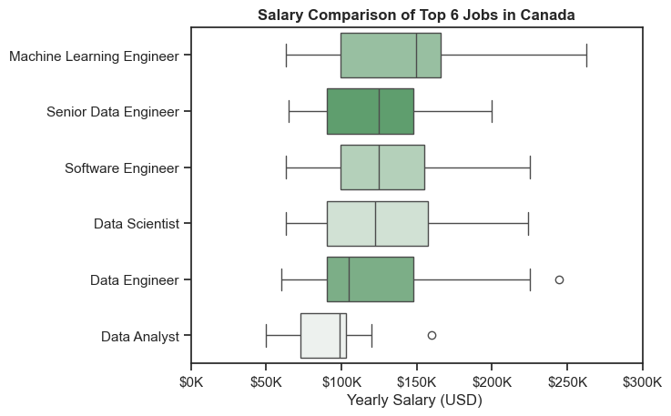
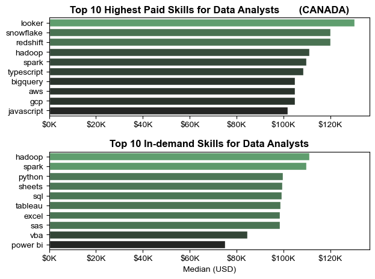
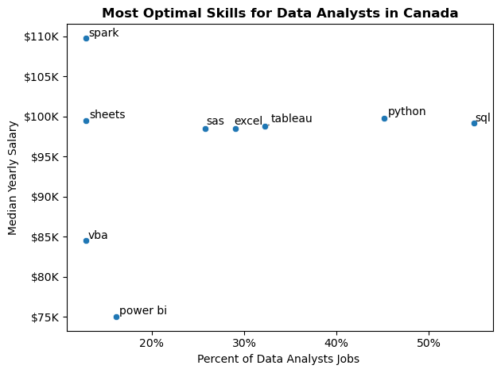
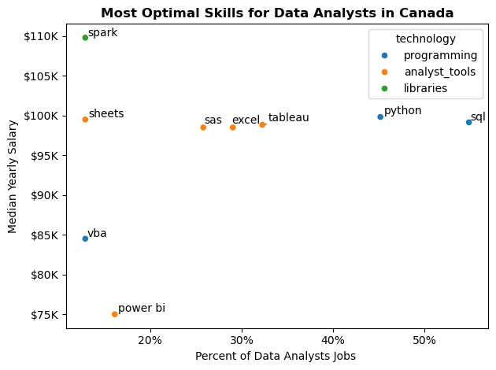

# Overview

Welcome to my analysis of the data job market, focusing on data analyst roles. This project was created out of a desire to navigate and understand the job market more effectively. It delves into the top-paying and in-demand skills to help find optimal job opportunities for data analysts in Canada.

The data sourced from [Luke Barousse's Python Course](https://lukebarousse.com/python) which provides a foundation for my analysis, containing detailed information on job titles, salaries, locations, and essential skills. Through a series of Python scripts, I explore key questions such as the most demanded skills, salary trends, and the intersection of demand and salary in data analytics.

# The Questions

Below are the questions I want to answer in my project:

1. What are the skills most in demand for the top 3 most popular data roles?
2. How are in-demand skills trending for Data Analysts?
3. How well do jobs and skills pay for Data Analysts?
4. What are the optimal skills for data analysts to learn? (High Demand AND High Paying) 

# Tools I Used

For my deep dive into the data analyst job market, I harnessed the power of several key tools:

- **Python:** The backbone of my analysis, allowing me to analyze the data and find critical insights.I also used the following Python libraries:
    - **Pandas Library:** This was used to analyze the data. 
    - **Matplotlib Library:** I visualized the data.
    - **Seaborn Library:** Helped me create more advanced visuals. 
- **Jupyter Notebooks:** The tool I used to run my Python scripts which let me easily include my notes and analysis.
- **Visual Studio Code:** My go-to for executing my Python scripts.
- **Git & GitHub:** Essential for version control and sharing my Python code and analysis, ensuring collaboration and project tracking.

# Data Preparation and Cleanup

This section outlines the steps taken to prepare the data for analysis, ensuring accuracy and usability.

## Import & Clean Up Data

I start by importing necessary libraries and loading the dataset, followed by initial data cleaning tasks to ensure data quality.

```python
# Importing Libraries
import ast
import pandas as pd
import seaborn as sns
from datasets import load_dataset
import matplotlib.pyplot as plt  

# Loading Data
dataset = load_dataset('lukebarousse/data_jobs')
df = dataset['train'].to_pandas()

# Data Cleanup
df['job_posted_date'] = pd.to_datetime(df['job_posted_date'])
df['job_skills'] = df['job_skills'].apply(lambda x: ast.literal_eval(x) if pd.notna(x) else x)
```

## Filter Canada Jobs

To focus my analysis on the Canada job market, I apply filters to the dataset, narrowing down to roles based in the Canada.

```python
df_US = df[df['job_country'] == 'Canada']

```

# The Analysis

Each Jupyter notebook for this project aimed at investigating specific aspects of the data job market. Here’s how I approached each question:

## 1. What are the most demanded skills for the top 3 most popular data roles?

To find the most demanded skills for the top 3 most popular data roles. I filtered out those positions by which ones were the most popular, and got the top 5 skills for these top 3 roles. This query highlights the most popular job titles and their top skills, showing which skills I should pay attention to depending on the role I'm targeting. 

View my notebook with detailed steps here: [2_Skill_Demand](Project/2_Skills_Demand.ipynb).

### Visualize Data

```python
fig , ax = plt.subplots(len(job_titles), 1)
sns.set_theme(style= 'ticks')

for i , title in enumerate(job_titles):
    df_plot = df_merged[df_merged['job_title_short'] == title].head(5)
    sns.barplot(data= df_plot, x = 'skills %', y = 'job_skills', ax = ax[i], hue = 'value counts', palette= 'dark:g', legend= False)
    ax[i].set_ylabel('')
    ax[i].set_xlabel('')
    ax[i].set_title(title, fontweight = 'bold')
    ax[i].set_xlim(0, 75)
    
    
    for n , v in enumerate(df_plot['skills %']):
        ax[i].text(v+1, n + 0.1, f'{v:.0f}%', va ='center')

    if i != len(job_titles) - 1:
        ax[i].set_xticks([])

    
    
fig.suptitle(f'Likelihood of Skills Requested in the Canada Job Postings({country})', fontweight ='bold', fontsize = 18)
fig.tight_layout()
```

### Results



*Bar graph visualizing the salary for the top 3 data roles and their top 5 skills associated with each.*

### Insights:

- SQL is the most requested skill for Data Analysts and Data Engineers, with it in over half the job postings for both roles. For Data Scientist, Python is the most sought-after skill, appearing in 61% of job postings.
- Data Engineers require more specialized technical skills, with AWS, Azure, and Spark appearing in 33-38% of job postings, compared to tools like Tableau at 16-25% for Scientists and Analysts.
- Python is a versatile skill, highly demanded across all three roles, but most prominently for Data Scientists (61%) and Data Enginners (61%%).

## 2. How are in-demand skills trending for Data Analysts?

To find how skills are trending in 2023 for Data Analysts, I filtered data analyst positions and grouped the skills by the month of the job postings. This got me the top 5 skills of data analysts by month, showing how popular skills were throughout 2023.

View my notebook with detailed steps here: [3_Skills_Trend](Project/3_Skills_Trend.ipynb).

### Visualize Data

```python

from matplotlib.ticker import PercentFormatter

ax = plt.gca()
ax.yaxis.set_major_formatter(PercentFormatter())

for i in range(5):
    plt.text(11.2, y =  df_CA_plot.iloc[-1, i] - 1, s= df_CA_pivot.columns[i])

plt.show()
```

### Results

  
*Bar graph visualizing the trending top skills for data analysts in Canada in 2023.*

### Insights:
- SQL remains the most consistently demanded skill throughout the year, although it shows a gradual decrease in demand.
- Excel experienced a significant increase in demand starting around May, surpassing both Python and Tableau for two months only and got decreased by the end of the year.
- Both show relatively stable demand throughout the year with some fluctuations but remain essential skill for data analysts. Power BI, while less demanded compared to the others, shows a more downwards trend towards the year's end.

## 3. How well do jobs and skills pay for Data Analysts?

To identify the highest-paying roles and skills, I only got jobs in the Canada and looked at their median salary. But first I looked at the salary distributions of common data jobs like Data Scientist, Data Engineer, and Data Analyst, to get an idea of which jobs are paid the most. 

View my notebook with detailed steps here: [4_Salary_Analysis](Project/4_Salary_Analysis.ipynb).

#### Visualize Data 

```python
sns.boxplot(data= df_CA_plot, x = 'salary_year_avg' , y = 'job_title_short' , hue= 'job_title_short', palette= 'light:g_r', order= sorted_6)
ax = plt.gca()
ax.xaxis.set_major_formatter(plt.FuncFormatter(lambda x, pos: f'${int(x/1000)}K'))
plt.xlim(0,300000)
plt.xlabel('Yearly Salary (USD) ')
plt.ylabel('')
plt.title('Salary Comparison of Top 6 Jobs in Canada', fontweight = 'bold')
plt.show()
```

#### Results

  
*Box plot visualizing the salary distributions for the top 6 data job titles.*

#### Insights

- There's a significant variation in salary ranges across different job titles. Machine Learning Enginner positions tend to have the highest salary potential, with up to $262K, indicating the high value placed on advanced data skills and experience in the industry.

- Data Engineer and Data Analyst roles show a considerable number of outliers on the salary spectrum, suggesting that exceptional skills or circumstances can lead to high pay in these roles. In contrast, Data Scientist roles demonstrate more consistency in salary, with fewer outliers.

### Highest Paid & Most Demanded Skills for Data Analysts

Next, I narrowed my analysis and focused only on data analyst roles. I looked at the highest-paid skills and the most in-demand skills. I used two bar charts to showcase these.

#### Visualize Data

```python

fig , ax = plt.subplots(2,1)
sns.set_theme(style = 'ticks')

for i , dataf in enumerate(plot_list):
    sns.barplot(data= dataf, x = 'median', y = dataf.index , ax=ax[i], hue = 'median', palette= 'dark:g', legend = False)
    ax[0].set_title('Top 10 Highest Paid Skills for Data Analysts       (CANADA)', fontweight = 'bold')
    ax[1].set_title('Top 10 In-demand Skills for Data Analysts', fontweight = 'bold')
    ax[0].set_xlabel('')
    ax[1].set_xlabel('Median (USD)')
    ax[i].set_ylabel('')
    ax[i].xaxis.set_major_formatter(plt.FuncFormatter(lambda x, pos: f'${int(x/1000)}K'))
    ax[1].set_xlim(ax[0].get_xlim())

fig.tight_layout()
 

plt.show()

```

#### Results
Here's the breakdown of the highest-paid & most in-demand skills for data analysts in Canada:


*Two separate bar graphs visualizing the highest paid skills and most in-demand skills for data analysts in the Canada.*

#### Insights:

- The top graph shows specialized technical skills like `looker`, `snowflake`, and `redshift` are associated with higher salaries, some reaching up to $130K, suggesting that advanced technical proficiency can increase earning potential.

- The bottom graph highlights that foundational skills like `Excel`, `Python`, and `SQL` are the most in-demand, even though they may not offer the highest salaries. This demonstrates the importance of these core skills for employability in data analysis roles.


## 4. What are the most optimal skills to learn for Data Analysts?

To identify the most optimal skills to learn ( the ones that are the highest paid and highest in demand) I calculated the percent of skill demand and the median salary of these skills. To easily identify which are the most optimal skills to learn. 

View my notebook with detailed steps here: [5_Optimal_Skills](Project/5_Optimal_skills.ipynb).

#### Visualize Data

```python
from adjustText import adjust_text
from matplotlib.ticker import PercentFormatter
text = []
sns.scatterplot(df_ca_plot, x = 'job %', y = 'median_salary', hue= 'technology')

for i, x in enumerate(df_ca_plot['job_skills']):
    text.append(plt.text(df_ca_plot['job %'].iloc[i], df_ca_plot['median_salary'].iloc[i], x))
plt.show()

```

#### Results

    
*A scatter plot visualizing the most optimal skills (high paying & high demand) for data analysts in the Canada.*

#### Insights:

- The skill `spark` appears to have the highest median salary of nearly $110K, despite being less common in job postings. This suggests a high value placed on specialized database skills within the data analyst profession.

- Skills such as `Python`, `Tableau`, and `SQL` are towards the higher end of the salary spectrum while also being fairly common in job listings, indicating that proficiency in these tools can lead to good opportunities in data analytics.

### Visualizing Different Techonologies

Let's visualize the different technologies as well in the graph. We'll add color labels based on the technology (e.g., {Programming: Python})

#### Visualize Data

```python
from matplotlib.ticker import PercentFormatter

# Create a scatter plot
scatter = sns.scatterplot(
    data=df_DA_skills_tech_high_demand,
    x='skill_percent',
    y='median_salary',
    hue='technology',  # Color by technology
    palette='bright',  # Use a bright palette for distinct colors
    legend='full'  # Ensure the legend is shown
)
plt.show()

```

#### Results

  
*A scatter plot visualizing the most optimal skills (high paying & high demand) for data analysts in the Canada with color labels for technology.*

#### Insights:

- The analyst_tools (colored orange), such as Sheets and Tableau, are associated with some of the highest salaries among data analyst tools. This indicates a significant demand and valuation for data management and manipulation expertise in the industry.

- Libraries (colored green), including spark and vba, are rare  in job postings  but do offer competitive salaries.

# What I Learned

Throughout this project, I deepened my understanding of the data analyst job market and enhanced my technical skills in Python, especially in data manipulation and visualization. Here are a few specific things I learned:

- **Advanced Python Usage**: Utilizing libraries such as Pandas for data manipulation, Seaborn and Matplotlib for data visualization, and other libraries helped me perform complex data analysis tasks more efficiently.
- **Data Cleaning Importance**: I learned that thorough data cleaning and preparation are crucial before any analysis can be conducted, ensuring the accuracy of insights derived from the data.
- **Strategic Skill Analysis**: The project emphasized the importance of aligning one's skills with market demand. Understanding the relationship between skill demand, salary, and job availability allows for more strategic career planning in the tech industry.


# Insights

This project provided several general insights into the data job market for analysts:

- **Skill Demand and Salary Correlation**: There is a clear correlation between the demand for specific skills and the salaries these skills command. Advanced and specialized skills like Python and Oracle often lead to higher salaries.
- **Market Trends**: There are changing trends in skill demand, highlighting the dynamic nature of the data job market. Keeping up with these trends is essential for career growth in data analytics.
- **Economic Value of Skills**: Understanding which skills are both in-demand and well-compensated can guide data analysts in prioritizing learning to maximize their economic returns.


# Challenges I Faced

This project was not without its challenges, but it provided good learning opportunities:

- **Data Inconsistencies**: Handling missing or inconsistent data entries requires careful consideration and thorough data-cleaning techniques to ensure the integrity of the analysis.
- **Complex Data Visualization**: Designing effective visual representations of complex datasets was challenging but critical for conveying insights clearly and compellingly.
- **Balancing Breadth and Depth**: Deciding how deeply to dive into each analysis while maintaining a broad overview of the data landscape required constant balancing to ensure comprehensive coverage without getting lost in details.


# Conclusion

This exploration into the data analyst job market has been incredibly informative, highlighting the critical skills and trends that shape this evolving field. The insights I got enhance my understanding and provide actionable guidance for anyone looking to advance their career in data analytics. As the market continues to change, ongoing analysis will be essential to stay ahead in data analytics. This project is a good foundation for future explorations and underscores the importance of continuous learning and adaptation in the data field.
